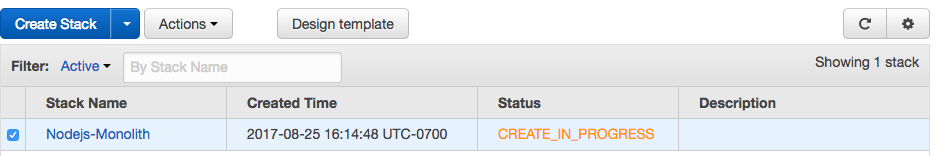
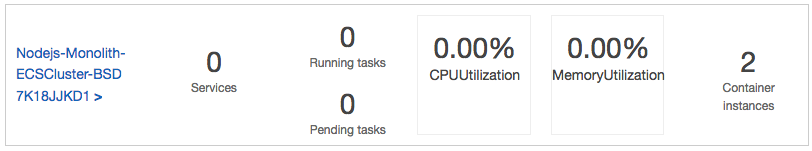
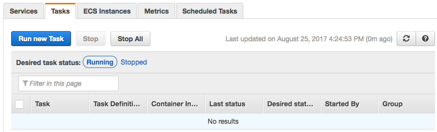
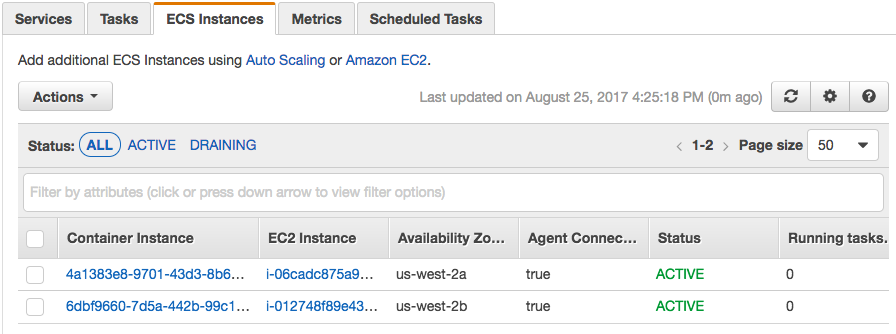
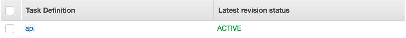
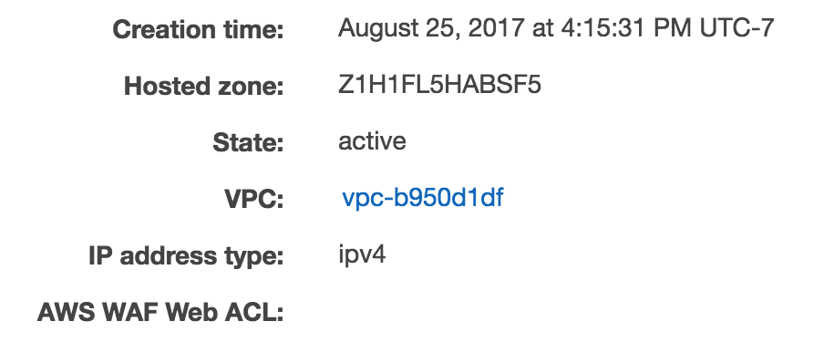

## Step 2 - Deploy the Monolith

#### 1. Launch an ECS Cluster using Cloudformation
First, we'll create a an Amazon ECS cluster, deployed behind an Application Load Balancer.

1. Navigate to the CloudFormation console: https://console.aws.amazon.com/cloudformation/home?.
2. Select `Create Stack`.
3. Select 'Upload a template to Amazon S3' and choose the `ecs.yml` file from the GitHub project at `amazon-ecs-nodejs-microservice/2-containerized/infrastructure/ecs.yml`
Select `Next`.
4. For stack name, enter `Nodejs-Monolith`.
Keep the other parameter values the same:
`Desired Capacity = 2`
`InstanceType = t2.micro`
`MaxSize = 2`
Select `Next`.
5. It is not nessecary to modify any options on this page. Select `Next`.
6. Check the box at the bottom of the next page and select `Create`.
You will see your stack with the orange `CREATE_IN_PROGRESS`. You can select the refresh button at the top right of the screen to check on the progress. This process typically takes under 5 minutes.

----
### 2. Check your cluster is running.

* Navigate to the [Amazon ECS console](https://console.aws.amazon.com/ecs/home?). Your cluster should appear in the list.

* Clicking into the cluster, select the 'Tasks' tab, no tasks will be running.

* Select the 'ECS Instances' tab, you will see the two EC2 Instances the Cloudformation template created.

---
#### 3. Write a Task Definition
The task definition tells Amazon ECS how to deploy our application containers across the cluster.

* Navigate to the 'Task Definitions' menu on the left side of the Amazon ECS console.
* Select `Create new Task Definition`.
* `Task Definition Name = api`.
* Select `Add Container`.
* Specify the following parameters. If a parameter is not defined, leave it blank or with the default settings:
`Container name = default`
`image = [account-id].dkr.ecr.[region].amazonaws.com/api:latest` the URL of your ECR respository image from the last step of this tutorial
`Memory = Hard limit: 256`
`Port mappings = Host port:0, Container port:3000`
`CPU units = 256`
* Select`Add`.
* Select `Create`.
* Your Task Definition will now show up in the console.

---
#### 4. Configure the Application Load Balancer: Target Group
The [Application Load Balancer (ALB)](http://docs.aws.amazon.com/elasticloadbalancing/latest/application/introduction.html) lets our service accept incoming traffic. The ALB automatically routes traffic to container instances running on our cluster using them as a [target group](http://docs.aws.amazon.com/elasticloadbalancing/latest/application/load-balancer-target-groups.html).

**Check your VPC Name**
If this is not your first time using this AWS account, you may have multiple VPCs. It is important to configure your Target Group with the correct VPC.
* Navigate to the [Load Balancer section of the EC2 Console](https://console.aws.amazon.com/ec2/v2/home?#LoadBalancers:).
* You should see a Load Balancer already exists named `demo`.
* Select the checkbox to see the Load Balancer details.
* Note the value for the `VPC` attribute on the details page.

**Configure the ALB Target Group**
* Navigate to the [Target Group section of the EC2 Console](https://console.aws.amazon.com/ec2/v2/home?#TargetGroups:).
* Select `Create target group`.
* Configure the Target Group (do not modify defaults if they are not specified here):
`Name = api`
`Protocol = HTTP`
`Port = 80`
`VPC =` _select the VPC that matches your Load Balancer from the previous step. This is most likely NOT your default VPC._
**Advanced health check settings**:
`Healthy threshold = 2`
`Unhealthy threshold = 2`
`Timeout = 5`
`Interval = 6`
* Select `Create`.

---
#### 5. Configure the Application Load Balancer: Listener
The [listener](http://docs.aws.amazon.com/elasticloadbalancing/latest/application/load-balancer-listeners.html) checks for incoming connection requests to your ALB.

**Add a Listener to the ALB**
* Navigate to the [Load Balancer section of the EC2 Console](https://console.aws.amazon.com/ec2/v2/home?#LoadBalancers:)
* You should see a Load Balancer already exists named `demo`.
* Select the checkbox to see the Load Balancer details.
* Select the `Listeners` tab.
* Select `Create Listener`:
Protocol = `HTTP`
Port = `80`
Default target group = `api`
* Click `Create`.

---
#### 6. Deploy the Monolith as a Service
Now, we'll deploy the monolith as a service onto the cluster.

* Navigate to the 'Clusters' menu on the left side of the Amazon ECS console.
* Select your cluster: `Nodejs-Monolith-ECSCluster`.
* Under the services tab, select `Create`.
* Configure the service (do not modify any default values):
Service name = `api`
Number of tasks = `1`
* Select `Configure ELB`:
  * ELB Type = `Application Load Balancer`.
  * For IAM role, select `Nodejs-Monolith-ECSServiceRole`.
  * Select your Load Balancer `demo`.
  * Select `Add to ELB`.
* Add your service to the target group:
Listener port = `80:HTTP`
Target group name = select your group: `api`
* Select `Save`.
* Select `Create Service`.
* Select `View Service`.

Nice work! You now have a running service. It may take a minute for the container to register as healthy and begin receiving traffic.

---
#### 7. Test your monolith
Validate your deployment by checking if the service is available from the internet and pinging it.

**To find your service URL:**
* Navigate to the [Load Balancers](https://console.aws.amazon.com/ec2/v2/home?#LoadBalancers:) section of the EC2 Console.
* Select your load balancer `demo-monolith`.
* Copy and paste the value for `DNS name` into your browser.
* You should see a message 'Ready to receive requests'.

**See the values for your service**
The ALB routes traffic based on the request URL. To see the service, simply add the service name (api) to the end of your DNS Name like this: `http://[DNS name]/api`

#### [Next](/Step-3.md)
