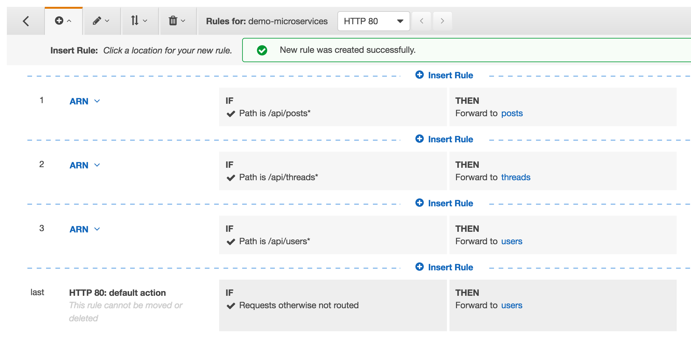
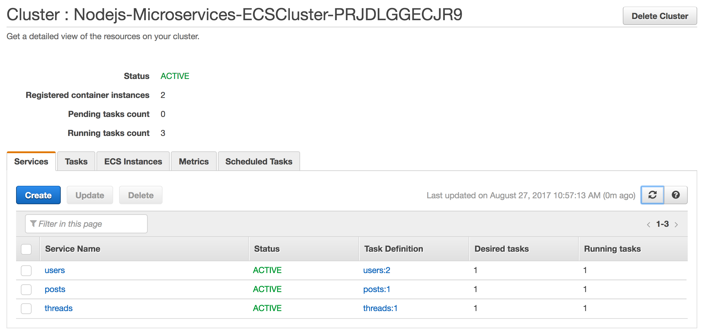
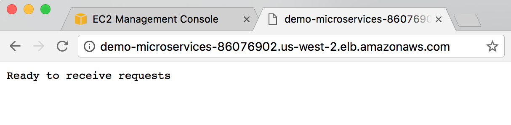
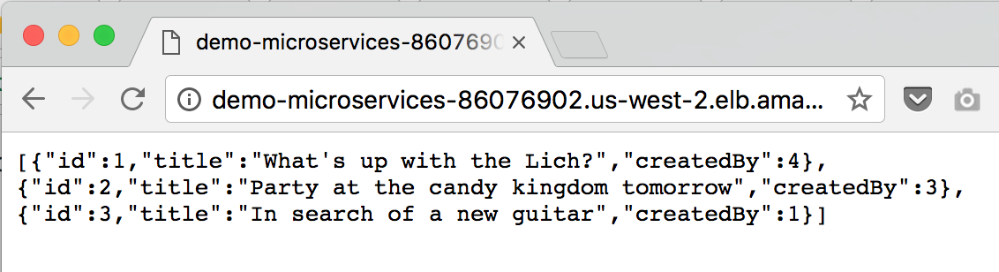

## Step 4 - Deploy Microservices

#### 1. Launch an ECS Cluster using Cloudformation
Now, we'll create a an Amazon ECS cluster, deployed behind an Application Load Balancer to host our microservices.

1. Navigate to the CloudFormation console: https://console.aws.amazon.com/cloudformation/home?
2. Select `Create Stack`
3. Select 'Upload a template to Amazon S3' and choose the `ecs.yml` file from the GitHub project at `amazon-ecs-nodejs-microservice/3-containerized/infrastructure/ecs.yml`
Select `Next`
4. For stack name, enter `Nodejs-Microservices`
Keep the other parameter values the same:
`Desired Capacity = 2`
`InstanceType = t2.micro`
`MaxSize = 2`
Select `Next`.
5. It is not nessecary to modify any options on this page. Select `Next`.
6. Check the box at the bottom of the next page and select `Create`.
You will see your stack with the orange `CREATE_IN_PROGRESS`. You can select the refresh button at the top right of the screen to check on the progress. This process typically takes under 5 minutes.

**Pro Tip**
You can also use the AWS CLI to deploy Cloudformation Stacks. Just add in your region to this code and run in the terminal from `amazon-ecs-nodejs-microservices/3-microservices`.
```
$ aws cloudformation deploy \
   --template-file infrastructure/ecs.yml \
   --region <region> \
   --stack-name Nodejs-Microservices \
   --capabilities CAPABILITY_NAMED_IAM
```

----
#### 2. Check your cluster is running.

* Navigate to the [Amazon ECS console](https://console.aws.amazon.com/ecs/home?). Your cluster should appear in the list.

* Clicking into the cluster, select the 'Tasks' tab, no tasks will be running.

* Select the 'ECS Instances' tab, you will see the two EC2 Instances the Cloudformation template created.

---
#### 3. Write Task Definitions for your Services
Like in [Part 2[(/getting-started/container-microservices-tutorial/step-two/), we'll write [Task Definitions](http://docs.aws.amazon.com/AmazonECS/latest/developerguide/task_definitions.html) for each service.

**Note**: it's possible to add multiple containers to a task definition - so feasibly we could run all three microservices as different containers through a single task. Our goal however, is to have _three independent services_ and each service requires its own task definition running a container with the image for that respective service.

You can either configure these Task Definitions through the UI or speed things up by writing them as JSON. To write the task definition as a JSON file, select `Configure via JSON` at the bottom of the new Task Definition screen.

The parameters for the task definition are:
Name = `[service-name]`
Image = `[service ECR repo URL]:latest`
cpu = `256`
memory = `256`
Container Port =  `3000`
Host Post = `0`

Or with JSON:
```
{
    "containerDefinitions": [
        {
            "name": "[service-name]",
            "image": "[account-id].dkr.ecr.us-west-2.amazonaws.com/[service-name]",
            "memoryReservation": "256",
            "cpu": "256",
            "essential": true,
            "portMappings": [
                {
                    "hostPort": "0",
                    "containerPort": "3000",
                    "protocol": "tcp"
                }
            ]
        }
    ],
    "volumes": [],
    "networkMode": "bridge",
    "placementConstraints": [],
    "family": "[service-name]"
}
```
**Repeat this step to create a task definition for each service**
* posts
* threads
* users

---
#### 4. Configure the Application Load Balancer: Target Groups
Like in [Part 2](/getting-started/container-microservices-tutorial/step-two/), we will be configuring target groups for each of our services. These allow traffic to correctly reach each service.

**Check your VPC Name**
The microservices stack we just deployed has its own VPC. It is important to configure your Target Group with the correct VPC.
* Navigate to the [Load Balancer section of the EC2 Console](https://console.aws.amazon.com/ec2/v2/home?#LoadBalancers:)
* You should see a Load Balancer already exists named `demo`.
* Select the checkbox to see the Load Balancer details.
* Note the value for the `VPC` attribute on the details page.

**Configure the ALB Target Group**
* Navigate to the [Target Group section of the EC2 Console](https://console.aws.amazon.com/ec2/v2/home?#TargetGroups:).
* Select `Create target group`.
* Configure the Target Group (do not modify defaults if they are not specified here):
`Name = [service-name]`
`Protocol = HTTP`
`Port = 80`
`VPC =` _select the VPC that matches your Load Balancer from the previous step_.
**Advanced health check settings**:
`Healthy threshold = 2`
`Unhealthy threshold = 2`
`Timeout = 5`
`Interval = 6`
* Select `Create`

**Repeat this step to create a target group for each service**
* posts
* threads
* users

---
#### 5. Configure Listener
Like in [Part 2](/getting-started/container-microservices-tutorial/step-two/), the [listener](http://docs.aws.amazon.com/elasticloadbalancing/latest/application/load-balancer-listeners.html) checks for incoming connection requests to your ALB in order to route traffic appropriately.

Because all three of our services run behind the same load balancer, we only need to create one listener, but with three rules for routing traffic to the appropriate service.

**Add a Listener to the ALB**
* Navigate to the [Load Balancer section of the EC2 Console](https://console.aws.amazon.com/ec2/v2/home?#LoadBalancers:)
* You should see a Load Balancer already exists named `demo-micoservies`.
* Select the checkbox to see the Load Balancer details.
* Select the `Listeners` tab.
* Select `Create Listener`.
Protocol = `HTTP`
Port = `80`
Default target group = `api`
* Click `Create`.

**Update Listener Rules**
* Select `View/edit rules >` for the listener you just created.
* Select the **+** and **insert rule**
* The rule criteria are:
IF `Path` = `/api/[service-name]*`
THEN Forward to `[service-name]`
_For example: Path = `/api/posts*` forward to `posts`_
* Create three new rules, one for each service. You will have a total of four rules, including the default.
  * posts
  * threads
  * users
* Select the back arrow at the top left of the page to return to the load balancer console.



---
#### 6. Deploy your Microservices
Now, we'll deploy our three services onto our cluster. Repeat these steps for each of our three services:

* Navigate to the 'Clusters' menu on the left side of the Amazon ECS console.
* Select your cluster: `Nodejs-Microservices-ECSCluster`.
* Under the services tab, select `Create`.
* Configure the service (do not modify any default values)
Task definition = select the highest value for X: `[service-name]:X` (X should = 1 for most cases)
Service name = `[service-name]`
Number of tasks = `1`
* Select `Configure ELB`
  * ELB Type = `Application Load Balancer`
  * For IAM role, select `Nodejs-Microservice-ECSServiceRole`
  * Select your Load Balancer `demo-microservices`
  * Select `Add to ELB`
* Add your service to the target group
Listener port = `80:HTTP`
Target group name = select your group: `[service-name]`
* Select `Save`
* Select `Create Service`
* Select `View Service`

It should only take a few seconds for all your servics to start.



---
#### 7. Validate your Deployment (optional)
Validate your deployment by checking if the service is available from the internet and pinging it.

**To find your service URL:**
* Navigate to the [Load Balancers](https://console.aws.amazon.com/ec2/v2/home?#LoadBalancers:) section of the EC2 Console.
* Select your load balancer `demo-microservices`.
* Copy and paste the value for `DNS name` into your browser.
* You should see a message 'Ready to receive requests'.



**See the values for each microservice**
Your ALB routes traffic based on the request URL. To see each service, simply add the service name to the end of your DNS Name like this:
* `http://[DNS name]/api/users`
* `http://[DNS name]/api/threads`
* `http://[DNS name]/api/posts`



You can also use tools such as [Postman](https://www.getpostman.com/) for testing your APIs.

#### [Next](/Step-5.md)
