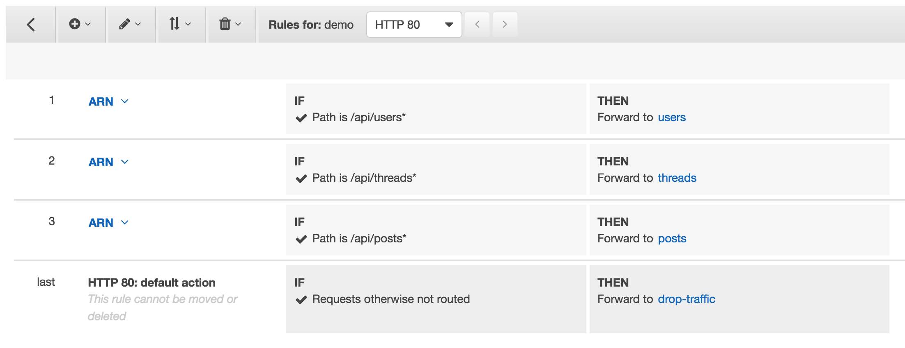

## Step 4 - Deploy Microservices

#### 1. Write Task Definitions for your Services
We're going to deploy our three new microservices onto the same cluster we started in [Part 2](/getting-started/container-microservices-tutorial/step-two/). Like in Part 2, we'll write [Task Definitions](http://docs.aws.amazon.com/AmazonECS/latest/developerguide/task_definitions.html) for each service.

**Note**: it's possible to add multiple containers to a task definition - so feasibly we could run all three microservices as different containers through a single task. Our goal however, is to have _three independent services_ and each service requires its own task definition running a container with the image for that respective service.

You can either configure these Task Definitions through the UI or speed things up by writing them as JSON. To write the task definition as a JSON file, select `Configure via JSON` at the bottom of the new Task Definition screen.

The parameters for the task definition are:
Name = `[service-name]`
Image = `[service ECR repo URL]:latest`
cpu = `256`
memory = `256`
Container Port =  `3000`
Host Post = `0`

Or with JSON:
```
{
    "containerDefinitions": [
        {
            "name": "[service-name]",
            "image": "[account-id].dkr.ecr.us-west-2.amazonaws.com/[service-name]:[tag]",
            "memoryReservation": "256",
            "cpu": "256",
            "essential": true,
            "portMappings": [
                {
                    "hostPort": "0",
                    "containerPort": "3000",
                    "protocol": "tcp"
                }
            ]
        }
    ],
    "volumes": [],
    "networkMode": "bridge",
    "placementConstraints": [],
    "family": "[service-name]"
}
```
**Repeat this step to create a task definition for each service**
* posts
* threads
* users

---
#### 2. Configure the Application Load Balancer: Target Groups
Like in [Part 2](/getting-started/container-microservices-tutorial/step-two/), we will be configuring target groups for each of our services. These allow traffic to correctly reach each service.

**Check your VPC Name**
Our Cloudformation stack has its own VPC, which is most likely not your default VPC. It is important to configure your Target Groups with the correct VPC.
* Navigate to the [Load Balancer section of the EC2 Console](https://console.aws.amazon.com/ec2/v2/home?#LoadBalancers:)
* You should see a Load Balancer already exists named `demo`.
* Select the checkbox to see the Load Balancer details.
* Note the value for the `VPC` attribute on the details page.

**Configure the Target Groups**
* Navigate to the [Target Group section of the EC2 Console](https://console.aws.amazon.com/ec2/v2/home?#TargetGroups:).
* Select `Create target group`.
* Configure the Target Group (do not modify defaults if they are not specified here):
`Name = [service-name]`
`Protocol = HTTP`
`Port = 80`
`VPC =` _select the VPC that matches your Load Balancer from the previous step_.
**Advanced health check settings:**:
`Healthy threshold = 2`
`Unhealthy threshold = 2`
`Timeout = 5`
`Interval = 6`
* Select `Create`

**Repeat this step to create a target group for each service:**
* `posts`
* `threads`
* `users`

**Then create a fourth target group:**
* `drop-traffic`

This target group is a 'dummy' target. We'll use it to keep traffic from reaching our monolith after our microservices are fully running. You should have 5 target groups total in your table.


---
#### 3. Configure Listener Rules
The [listener](http://docs.aws.amazon.com/elasticloadbalancing/latest/application/load-balancer-listeners.html) checks for incoming connection requests to your ALB in order to route traffic appropriately.

Right now, all four of our services (monolith and our three microservices) are running behind the same load balancer. To make the transition from monolith to microservices, we'll start routing traffic to our microservices and stop routing traffic to our monolith.

**Open your a listener**
* Navigate to the [Load Balancer section of the EC2 Console](https://console.aws.amazon.com/ec2/v2/home?#LoadBalancers:)
* You should see a Load Balancer already exists named `demo`.
* Select the checkbox to see the Load Balancer details.
* Select the `Listeners` tab.

**Update Listener Rules**
* Select `View/edit rules >` for the listener.
* Select the **+** and **insert rule**
* The rule criteria are:
IF `Path` = `/api/[service-name]*`
THEN Forward to `[service-name]`
_For example: Path = `/api/posts*` forward to `posts`_
* Create four new rules, one to maintain traffic to the monolith, and one for each service. You will have a total of five rules, including the default. Ensure you add your rules in this oder:
  1. **api**: `/api*` forwards to `api`
  2. **users**: `/api/users*` forwards to `users`
  3. **threads**: `/api/threads*` forwards to `threads`
  4. **posts**: `/api/posts*` forwards to `posts`
* Select the back arrow at the top left of the page to return to the load balancer console.


---
#### 4. Deploy your Microservices
Now, we'll deploy our three services onto our cluster. Repeat these steps for each of our three services:

* Navigate to the 'Clusters' menu on the left side of the Amazon ECS console.
* Select your cluster: `BreakTheMonolith-Demo-ECSCluster`.
* Under the services tab, select `Create`.
* Configure the service (do not modify any default values)
Task definition = select the highest value for X: `[service-name]:X` (X should = 1 for most cases)
Service name = `[service-name]`
Number of tasks = `1`
* Select `Configure ELB`
  * ELB Type = `Application Load Balancer`
  * For IAM role, select `BreakTheMonolith-Demo-ECSServiceRole`
  * Select your Load Balancer `demo`
  * Select `Add to ELB`
* Add your service to the target group
Listener port = `80:HTTP`
Target group name = select your group: `[service-name]`
* Select `Save`
* Select `Create Service`
* Select `View Service`

It should only take a few seconds for all your services to start. Double check that all services and tasks are running and healthy before you proceed.


---
#### 5. Switch over traffic to your microservices
Right now, your microservices are running but all traffic is going to your monolith.

**Update Listener Rules to route your traffic**
* Navigate to the [Load Balancer section of the EC2 Console](https://console.aws.amazon.com/ec2/v2/home?#LoadBalancers:)
* Select `View/edit rules >` for the listener on the `demo` load balancer.
* Delete the first rule (`/api*` forwards to `api`).
* Update the default rule to forward to `drop-traffic`.

Your rules should look like this:


**Turn off the Monolith**
Now, traffic is flowing to your microservices and we can spin down our Monolith service.
* Navigate back to your Amazon ECS cluster `BreakTheMonolith-Demo-ECSCluster`.
* Select the `api` service and then `Update`.
* Change **Number of Tasks** to `0`.
* Select `Update Service`.

Amazon ECS will now drain any connections from containers the service has deployed on the cluster then stop the containers. If you refresh the _Deployments_ or _Tasks_ lists after about 30 seconds, you'll see that the number of tasks will drop to 0. The service is still active, so if you needed to roll back for any reason, you could simply update it to deploy more tasks.

* Select the `api` service and then `Delete` and confirm delete.

You've now fully transitioned your node.js from the monolith to microservices, without _**any downtime**_!

---
#### 6. Validate your Deployment

**Find your service URL:**
This is the same URL that you used in Part 2 of this tutorial.
* Navigate to the [Load Balancers](https://console.aws.amazon.com/ec2/v2/home?#LoadBalancers:) section of the EC2 Console.
* Select your load balancer `demo-microservices`.
* Copy and paste the value for `DNS name` into your browser.
* You should see a message 'Ready to receive requests'.

**See the values for each microservice**
Your ALB routes traffic based on the request URL. To see each service, simply add the service name to the end of your DNS Name like this:
* `http://[DNS name]/api/users`
* `http://[DNS name]/api/threads`
* `http://[DNS name]/api/posts`


Notice that these URLs perform _exactly_ the same as when the monolith is deployed. This is important because any APIs or consumers that would expect to connect to this app would not be affected by the changes we made. Going from monolith to microservices required no changes to other services.

#### [Next](/Step-5.md)
