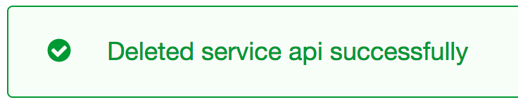
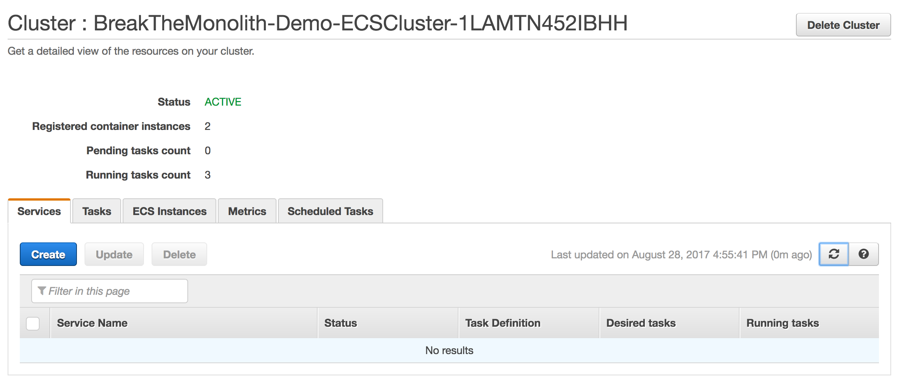
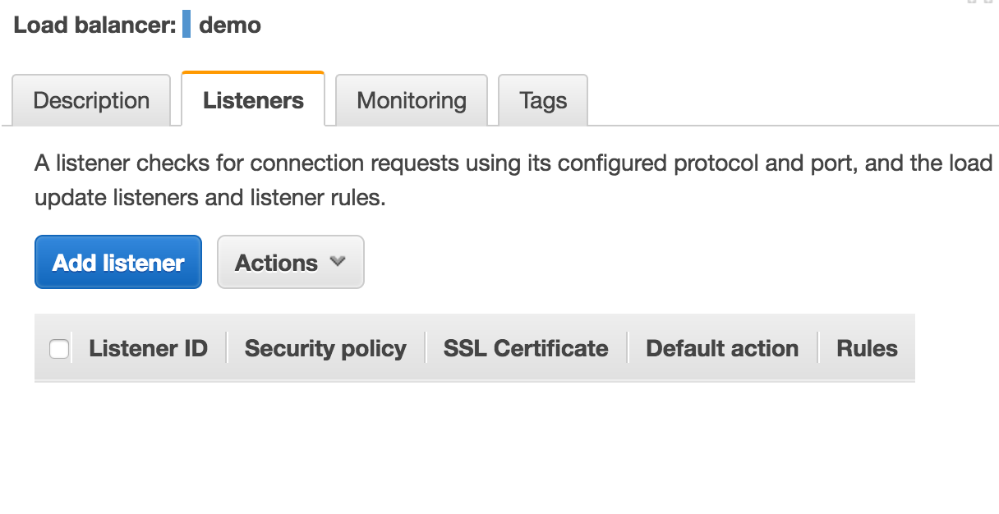
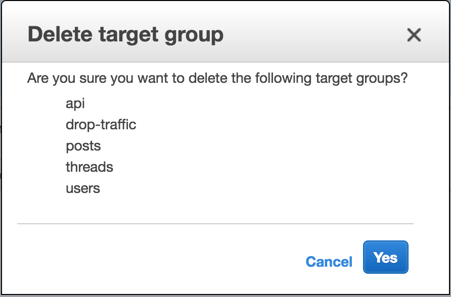
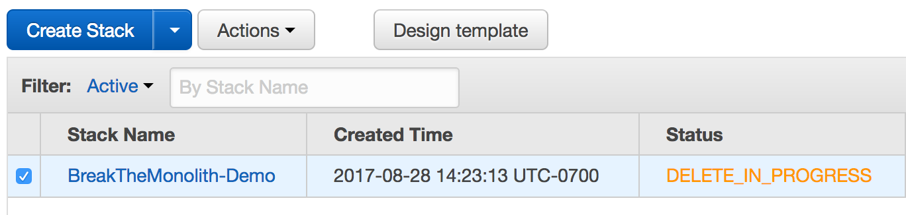
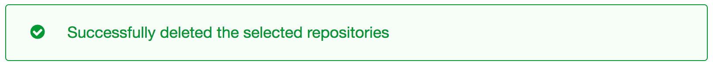

## Step 5 - Clean Up

#### 1. Turn off your services
Start cleaning up by spinning down each of the services you have running on your cluster.
* `posts`
* `threads`
* `users`

**Update Service**
* Open the cluster and click into a service.
* Select `Update`
* Change `Number of tasks` to `0`
* Select `Update Service`
* Select `View Service` to go back

**Delete Service**
* Select `Delete` on the service console page and confirm.
* You will get a confirmation message and your cluster will be empty.

Repeat these steps for each of your services on the cluster.

---
#### 2. Delete listeners
* Navigate to the [Load Balancer section of the EC2 Console](https://console.aws.amazon.com/ec2/v2/home?#LoadBalancers:)
* Select your load balancer `demo` and select the **Listeners** tab.
* Select the listener, then `Actions` > `Delete`.
* Confirm delete. Your listener should be gone.

---
#### 3. Delete target groups
* Navigate to [Target Groups](https://console.aws.amazon.com/ec2/v2/home?#TargetGroups:) in the EC2 console.
* Check the box at the top of the list to select all target groups.
* Select `Actions` > `Delete`.
* Confirm Delete.

---
#### 4. Rollback your AWS Cloudformation Stack
* Navigate to the CloudFormation console: https://console.aws.amazon.com/cloudformation/home?
* Check the box next to the Cloudformation stack you created earlier: `BreakTheMonolith-Demo`.
* Select `Actions` > `Delete Stack`
* Confirm Delete.
* The stack status should change to `DELETE_IN_PROGRESS`

**WARNING! Leaving a stack running will result in charges on your AWS account.**

---
#### 5. Deregister Task Definitions
* Navigate to [Task Definitions](https://console.aws.amazon.com/ecs/home?#/taskDefinitions) in the Amazon ECR console.
* Click into a task definition. You will see a list of task definition revisions.
* Select all using the checkbox at the top of the list.
* Select `Actions` > `Deregister` and confirm.

**Repeat these steps for all four task definitions**

---
#### 6. Delete Amazon ECR Repositories
* Navigate to [Repositories](https://console.aws.amazon.com/ecs/home?#/repositories) in the Amazon ECR console.
* Check the box at the top of the list to select all repositories
* Select `Delete Repository` and confirm.
* You will see a confirmation message and should have no more repositories.

